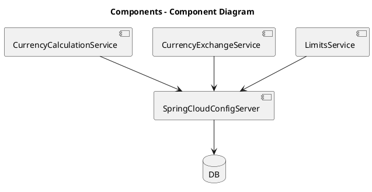
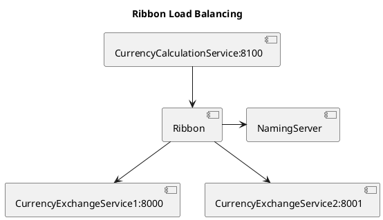
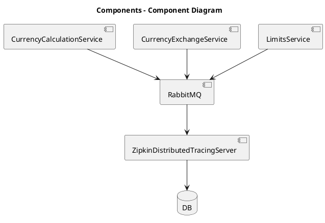

# Source of example
This example is created according to course [microservices with spring boot and spring cloud](https://www.udemy.com/course/microservices-with-spring-boot-and-spring-cloud/learn/lecture/8005670#overview)

Reference to [git repository](https://github.com/in28minutes/spring-microservices/tree/master/03.microservices) where
 this course is presented. 

# Wiring _cloud server_ and _service_
in service **limits-service** it is necessary rename *application.properties* file to *bootstrap.properties* and add key

 **spring.cloud.config.uri**=http://localhost:8888
 
 which defines where *cloud server* is running and has configuration for **limits-service** which can be retrieved.
 
# Defining profile to use
There can be several profiles for service (dev, qa, default...). To specify one of them it is necessary in **limits
-service** *bootstrap.properties* add 

```
spring.profiles.active=dev
```
which will cause that configuration for **LimitsService** is picked for profile dev. It is necessary to have in git
 repository corresponding property files (*limits-service-dev.properties*) 



Currently it isn't posssible to poick up changes in configuration GIT repository during running of service. To
 refresh current configuration you can send 
 ```
curl --location --request POST 'http://localhost:8081/actuator/refresh'
```
but before this it is necessary to configure service (in application.properties) with
```
management.endpoints.web.exposure.include=*
```

But in case of hundreds of microservices with 10s instances it would be required to 1000s call of refresh request. It
 is place where **spring cloud bus** count on scene.
 
Add to service and to **spring-cloud-config-server** dependency
```
<dependency>
    <groupId>org.springframework.cloud</groupId>
    <artifactId>spring-cloud-starter-bus-amqp</artifactId>
</dependency>
```
Now after restarting cloud config server and services you can change configuration (in git repository) and after
 triggering request
```
curl --location --request POST 'http://localhost:8080/actuator/bus-refresh'
```
configuration is refreshed on all services.

## Spring cloud bus
# Feign
To use feign
* dependency which make it easier to call service from other service. It is necessary to include it through
 dependency:
```
<dependency>
    <groupId>org.springframework.cloud</groupId>
    <artifactId>spring-cloud-starter-openfeign</artifactId>
</dependency>
```

* enable through annotation *@EnableFeignClients* in which there is specified value of package. This annotation
 is defined above *spring boot application*.
* define proxy interface:
  * annotation **@FeignClient(name={name_of_service}, url={server}:{port})
  * method:
    * defined **@GetMapping** annotation
    * name of method from other service and own DTO used in local service for handling retrieved values.
    
# Ribbon - load balancing
Dependency which make it possible to load balance request. Necessary steps:
* add dependency
```
<dependency>
    <groupId>org.springframework.cloud</groupId>
    <artifactId>spring-cloud-starter-netflix-ribbon</artifactId>
</dependency>
```
* add annotation to proxy interface created for feign - *@RibbonClient(name="{requested_microservice_name}")* (in
 currency-calculation-service)
* add to *application.properties* file list of URIs on which runs instances of requested microservice (in currency-calculation-service).
```
currency-exchange-service.ribbon.listOfServers=http://localhost:8000,http://localhost:8001
```


Now request are alternatively routed by **Ribbon** to 8000 and 8001 

## Dynamic load balancing with EUREKA naming server
It isn't very difficult to have hardcoded list of intances of some service (with port numbers). It is after each
 starting up or shutting down instance necessary physically change configuration in **.properties** file to add
  server to *listOfServers* property.

It would be required automate this process. Using service shouldn't care about list of currently live
 (running) application. It is where **Eureka** naming server comes to play.
 
 Eureka is naming server to which are microservice instances registrated (after start) and from where are discovered
  (where is service running) by other services.
  
### Steps to configure
* configure *Naming server*
    * dependencies ```spring-cloud-starter-netflix-eureka-server, spring-cloud-starter-config, spring-boot-devtools```
    * application.properties - ```eureka.client.register-with-eureka=false, eureka.client.fetch-registry=false```
    * annotation above app classs - **@EnableEurekaServer**
* configure client
    * in application which should register to naming server add in dependencies - ```spring-cloud-starter-netflix-eureka-client```
    * above application class add annotation **@EnableDiscoveryClient**
    * to *application.properties* file add ```eureka.client.service-url.default-zone=http://{server}:{port}/eureka```
  
# API gateway - ZUUL server
* create component
    * add annotations **@EnableZuulProxy** and **@EnableDiscoveryClient** above application class
    * specify application name, port and eureka server in **application.properties** file.
* what to do when service call is intercepted
    * define some filter (something which will extend **ZuulFilter**) e. g. for logging
* all important request should pass through ZULL
    * call defined services through zull -
    instead of ```http://{server}:{service_port}/path1/path2/....```
    call
    ```http://{server}:{zuul_port}/{service_name}/path1/path2/....```
    
# Sleuth - detective - tracking request across several microservices.
Add to pom ```spring-cloud-starter-sleuth``` and add to application classs of every service which should be tracked
 following code:
 ```java
	@Bean
	public Sampler defaultSampler() {
		return Sampler.ALWAYS_SAMPLE;
	}

``` 

Now when you logg some mesage through logger than you will find unique ID for request which is passing through
 several services like follows:
```java
INFO [currency-conversion-service,95ce225148b323a4,788ee2471a70c844,true]
```

Now all logs are distributed in consoles of applications and it is very painful to look for ID in separated logs. 

# RabbitMQ and Zipkin
Messages (logs) collected through Sleuth are sent to RabbitMQ message queue and from there are send to Zipkin.

Add following dependencies to all services which you want to have logs aggregated:
```
		<!-- mq and zipkin for agregating messages -->
		<dependency>
			<groupId>org.springframework.cloud</groupId>
			<artifactId>spring-cloud-starter-zipkin</artifactId>
		</dependency>
		<dependency>
			<groupId>org.springframework.amqp</groupId>
			<artifactId>spring-rabbit</artifactId>
		</dependency>
		<!-- :mq and zipkin for agregating messages -->
```
Rabit MQ should be installed and running on system.
Zipkin server also has to be downloaded (simple JAR and started). Before start it is necessary to set system variable:
```
    RABBIT_URI=amqp://localhost
```
Starting is done via command:
```
java -jar zipkin-server{suffix}.jar
```
To force service to use MQ and zipkin it is necessary to add following dependency to particular pom:
```
		<dependency>
			<groupId>org.springframework.cloud</groupId>
			<artifactId>spring-cloud-starter-zipkin</artifactId>
		</dependency>
		<dependency>
			<groupId>org.springframework.amqp</groupId>
			<artifactId>spring-rabbit</artifactId>
		</dependency>
```
Request some resource through REST service. Then it is possible to go to URI *localhost:9411/zipkin* where there is
 available complete trace of URI
 calls for
 serfices where previous dependency was added. 
 
# Hystrix - fault tolernce
Add to pom.xml dependency:
```
    <dependency>
        <groupId>org.springframework.cloud</groupId>
        <artifactId>spring-cloud-starter-hystrix</artifactId>
    </dependency>
```
Add above application class **@EnableHystrix** annotation
Addd above method for retreiving resource (where is e.g. **@GetMapping** annotation) annotation
```java
@HystrixCommand(fallbackMethod="{fallback_method_name}")

//.....

public fallback_method_name() {
    //TODO implement fallback behaviour.
}
```
Now when method annoted with @HystrixCommand.... doesn't fail but execute fallback_method_name().